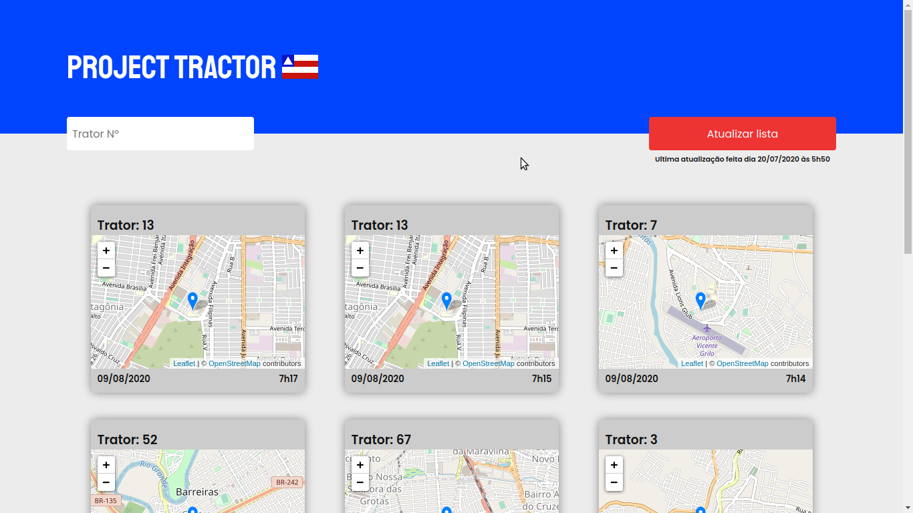

# TractorProject-Backend
### Prototype to solve problems of control with loan tractors by the Government of the state of Bahia

## Built with:
- TypeScript
- React
- React-Leaflet
- Axios
- A lot of coffee :)

## Instructions
- Open your terminal.
- Insert `git clone https://github.com/LucasAdorno/TractorProject-FrontEnd.git`
- Insert `cd TractorProject-FrontEnd`
- if you don't have nodeJS on your device, install https://nodejs.org/en/download/
- Insert the `npm i` to install all dependencies.
- Insert `npm run start` to run.

## Preview
  
